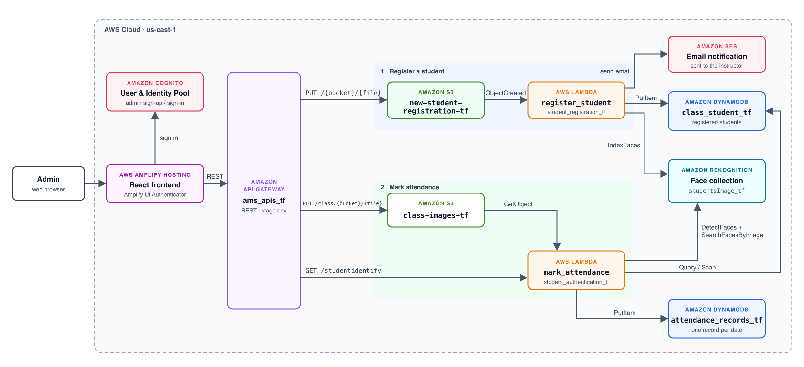

# Serverless Attendance

**Face-recognition attendance system built on AWS.**

Take attendance for a whole class by uploading **one group photo**. The app finds every face in the photo, matches each one against the registered students with **Amazon Rekognition**, and records who was present and who was absent for that date. There are no servers to manage: the whole stack runs on AWS managed services and is created with **Terraform**.

<p align="center">
  
  
</p>

---

## Features

- **Secure admin login.** Sign-up and sign-in use Amazon Cognito and the Amplify `Authenticator`.
- **Student registration.** Enter a student's first name, last name and email ID and upload a photo. Rekognition indexes the face and stores the student in DynamoDB.
- **Email notifications.** Amazon SES emails the instructor each time a student is registered.
- **One-photo attendance.** Upload a class photo and pick a date. Every face in the photo is detected and matched, and the app shows the present and absent students right away.
- **Attendance history.** Each session is saved to DynamoDB, keyed by date.
- **Infrastructure as code.** One `terraform apply` creates the whole backend, and `terraform destroy` removes it.

## Architecture

<p align="center">
  
</p>

### How it works

**Registering a student**
1. The frontend uploads the photo through API Gateway to the `new-student-registration-tf` S3 bucket. The file is named `<first>_<last>_<emailId>.<ext>`.
2. The upload's S3 `ObjectCreated` event triggers the **`register_student`** Lambda (AWS function name `student_registration_tf`).
3. The Lambda indexes the face into the Rekognition collection `studentsImage_tf` and saves the `FaceId` and student details to the `class_student_tf` DynamoDB table.
4. The Lambda sends a confirmation email through SES.

**Marking attendance**
1. The frontend uploads the class photo to the `class-images-tf` bucket.
2. The frontend calls `GET /studentidentify?objectKey=…&date_of_attendance=…`, which invokes the **`mark_attendance`** Lambda (AWS function name `student_authentication_tf`).
3. The Lambda detects every face, crops each one, and searches for it in the Rekognition collection.
4. Matched students are marked present and all other registered students are marked absent. The result is saved to `attendance_records_tf` and returned to the UI.

## Tech stack

| Layer          | Services / tools                                          |
| -------------- | --------------------------------------------------------- |
| Frontend       | React 18, AWS Amplify UI, Reactstrap                      |
| Auth           | Amazon Cognito (User Pool + Identity Pool)                |
| API            | Amazon API Gateway (REST)                                 |
| Compute        | AWS Lambda (Python, boto3, Pillow)                        |
| Face matching  | Amazon Rekognition                                        |
| Storage        | Amazon S3, Amazon DynamoDB                                |
| Notifications  | Amazon SES                                                |
| Hosting        | AWS Amplify Hosting                                       |
| IaC            | Terraform                                                 |

## Project structure

```
.
├── docs/                     # Architecture diagram (SVG source + PNG)
├── frontend/                 # React app (Create React App)
│   └── src/
│       ├── App.js            # Main UI: registration + attendance
│       ├── aws-exports.js    # Amplify / Cognito config (reads env vars)
│       └── images/           # Logo and screenshots
├── lambdas/
│   ├── register_student/     # Indexes a new student's face (S3 trigger)
│   └── mark_attendance/      # Matches faces in a class photo (API Gateway)
├── terraform/                # All AWS infrastructure
│   ├── amplify.tf  apiGateway.tf  cognito.tf  dynamodb.tf
│   ├── iamRoleAndPolicies.tf  lambdaFunction.tf
│   ├── rekognition.tf  s3.tf  ses.tf
│   └── build/                # Lambda zips generated by Terraform (git-ignored)
└── SES_EMAIL.txt             # Email address used by SES
```

## Getting started

### Prerequisites

- An AWS account and the [AWS CLI](https://aws.amazon.com/cli/) configured with credentials (`aws configure`)
- [Terraform](https://developer.hashicorp.com/terraform/downloads) ≥ 1.0
- [Node.js](https://nodejs.org/) ≥ 16 and npm
- A GitHub personal access token (only needed to deploy the frontend with Amplify Hosting)

All resources are created in **`us-east-1`**.

### 1. Clone the repository

```bash
git clone https://github.com/meghanaNanuvala/serverless-attendance.git
cd serverless-attendance
```

### 2. Configure before deploying

1. **SES email.** Put the email address that should receive registration notifications in `SES_EMAIL.txt`:
   ```
   SES_EMAIL=you@example.com
   ```
   Use a personal inbox, because some institutional mail servers block SES verification emails. AWS sends a verification link to this address after `terraform apply`, and you must click it before emails will be delivered.
2. **Amplify hosting (optional).** In `terraform/amplify.tf`, set `repository` to your GitHub repo URL and `access_token` to your GitHub token. Load the token from a variable or environment variable rather than committing it.
3. **Bucket names.** S3 bucket names must be unique across all of AWS. If `terraform apply` reports that a bucket already exists, rename the buckets in `terraform/s3.tf` and update the matching paths in `frontend/src/App.js` and the Lambda code.

### 3. Deploy the infrastructure

```bash
cd terraform
terraform init      # download providers
terraform plan      # review what will be created
terraform apply     # create the resources
```

### 4. Run the frontend

**Option A: AWS Amplify Hosting**

1. Open the **AWS Amplify** console and select the `serverless-attendance` app.
2. Start a build on the `main` branch. The build spec injects the API Gateway URL and Cognito IDs automatically.
3. When the deploy finishes, open the app URL that Amplify shows.

**Option B: run locally**

```bash
cd frontend
npm install
npm start           # http://localhost:3000
```

When running locally, create `frontend/.env.local` with the values from your Terraform deployment:

```
REACT_APP_API_ENDPOINT=<API Gateway invoke URL>
REACT_APP_aws_cognito_identity_pool_id=<identity pool id>
REACT_APP_aws_user_pools_id=<user pool id>
REACT_APP_aws_user_pools_web_client_id=<user pool client id>
```

## Using the app

1. **Sign up or sign in** as an admin.
2. **Add a student.** Enter a first name, last name and email ID, and upload a clear, front-facing photo that contains only that student.
3. **Take attendance.** Choose the date, upload a group photo of the class and submit. The app lists the present and absent students.

> **Tip:** Recognition works best with well-lit photos in which faces are unobstructed and reasonably large.

## Clean up

To avoid ongoing AWS charges, destroy everything when you are done:

```bash
cd terraform
terraform destroy
```

If the S3 buckets still contain images, empty them first, or `destroy` may fail.
